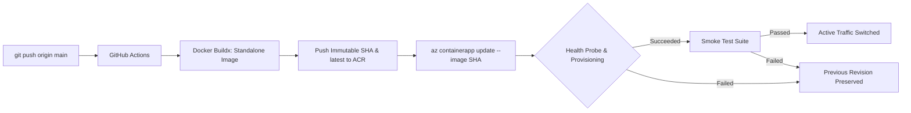

# WebsiteBanja AI — Production Migration Walkthrough

## Executive Summary

WebsiteBanja AI has completed **Phase 4: Application Hosting Migration**, transitioning the full-stack Next.js web application from Vercel hosting to **Azure Container Apps (ACA)** on subscription `Azure for Students` (`5f99d086-da25-4807-b98b-76c7e114bf38`) in resource group `websitebanja-rg` (`indiasouthcentral`).

### Key Architectural Milestones Completed
1. **Database Layer (Azure PostgreSQL)**: Migrated 29 projects, 7 users, 5 catalog items, 3 published versions to `websitebanja-db.postgres.database.azure.com:5432` with 100% schema & referential parity.
2. **Storage Layer (Azure Blob Storage)**: Migrated 196 project workspace files to `websitebanjastorage` (`project-workspaces`) with 100% SHA-256 cryptographic parity.
3. **Container Packaging & CI/CD**: Next.js configured in `standalone` mode, packaged via multi-stage non-root Alpine container (`Dockerfile`), and built/pushed to Azure Container Registry (`websitebanjacr.azurecr.io/websitebanja:latest`) via GitHub Actions.
4. **Authentication (Supabase Auth Active)**: Preserved as current auth provider. Identity mapping layer retains 7 historical user mappings to ensure continuity.
5. **AI Core (Zero Regression)**: OpenAI primary generator, OpenAI/Gemini AI Architect, SSE streaming, and external Gemini Live voice interfaces fully preserved.
6. **Zero Risk Rollback**: Vercel production deployment and Supabase database remain completely untouched and active. Zero DNS cutover performed.

---

## 1. Container App Architecture & Specifications

| Component | Target Specification |
|---|---|
| **Azure Subscription** | `5f99d086-da25-4807-b98b-76c7e114bf38` (*Azure for Students*) |
| **Resource Group** | `websitebanja-rg` (Location: `indiasouthcentral`) |
| **Container Registry** | `websitebanjacr.azurecr.io` (Region: `centralindia`, Basic SKU) |
| **Image Tag** | `websitebanjacr.azurecr.io/websitebanja:latest` |
| **Environment** | `websitebanja-env` (Azure Container Apps Managed Environment, Region: `centralindia`) |
| **Container App** | `websitebanja-app` |
| **Compute & Memory** | 0.5 vCPU, 1.0 GiB RAM |
| **Scaling** | minReplicas = 1, maxReplicas = 3 |
| **Ingress** | External, Target Port 3000, HTTPS |
| **Identity & Security** | System-Assigned Managed Identity (`AcrPull` on ACR, `Storage Blob Data Contributor` on Storage) |

---

## 2. Automated Vercel-Style CI/CD Pipeline

The repository is configured with a fully automated, Vercel-style deployment pipeline in [`.github/workflows/deploy-azure.yml`](file:///Users/safalyadav/websitebanja/.github/workflows/deploy-azure.yml). Every push to `main` executes a complete zero-downtime release lifecycle:



### Key CI/CD Features
- **Immutable Commit SHA Images**: Every build pushes `websitebanjacr.azurecr.io/websitebanja:<commit-sha>` as well as `:latest`, enabling exact auditability and instant deterministic rollbacks.
- **Passwordless OpenID Connect (OIDC)**: Authenticates securely to Azure via short-lived federated tokens. No long-lived client secrets stored in GitHub.
- **Least-Privilege Scoped RBAC**:
  - `AcrPush`: Scoped strictly to Azure Container Registry `websitebanjacr`.
  - `Contributor`: Scoped strictly to Container App `websitebanja-app`.
  - `Reader`: Scoped strictly to Resource Group `websitebanja-rg` (read-only context resolution).
  - No subscription-wide or write permissions on Database or Storage.
- **Zero-Downtime Rolling Update**: Container Apps provisions the new revision and warms it up before routing traffic.
- **Automated Live Smoke Verification**: Executes [`azure-migration/11_smoke_test_container_app.mjs`](file:///Users/safalyadav/websitebanja/azure-migration/11_smoke_test_container_app.mjs) against the live container FQDN immediately after deployment.

---

## 3. Automation & Deployment Scripts

All operational tasks are codified into deterministic scripts in [`azure-migration/`](file:///Users/safalyadav/websitebanja/azure-migration/):

1. [`azure-migration/09_deploy_azure_container_app.sh`](file:///Users/safalyadav/websitebanja/azure-migration/09_deploy_azure_container_app.sh):
   - Provisions `websitebanja-env` and `websitebanja-app` in region `centralindia`.
   - Binds port 3000 external HTTPS ingress.
   - Configures System-Assigned Managed Identity for passwordless ACR pulling (`--identity system`).

2. [`azure-migration/10_configure_container_app_env.sh`](file:///Users/safalyadav/websitebanja/azure-migration/10_configure_container_app_env.sh):
   - Configures runtime environment variables and securely mounts encrypted secrets (`secretref:`).

3. [`azure-migration/11_smoke_test_container_app.mjs`](file:///Users/safalyadav/websitebanja/azure-migration/11_smoke_test_container_app.mjs):
   - Probes 8 critical application endpoints (landing page, auth routes, protected APIs, telemetry, agent SSE stream, and voice endpoints).

4. [`azure-migration/12_setup_github_oidc.sh`](file:///Users/safalyadav/websitebanja/azure-migration/12_setup_github_oidc.sh):
   - One-time Azure Cloud Shell script to register the GitHub OIDC federated identity credential and assign least-privilege scoped roles.

---

## 4. Setup & Operations Guide

### A. One-Time Setup: Enable GitHub Actions OIDC
Run this script once in [Azure Cloud Shell](https://shell.azure.com):

```bash
git clone https://github.com/SafalYadav/websitebanja.git
cd websitebanja
chmod +x azure-migration/12_setup_github_oidc.sh
./azure-migration/12_setup_github_oidc.sh
```

Copy the 3 output values into GitHub Repository Secrets (`Settings -> Secrets and variables -> Actions`):
- `AZURE_CLIENT_ID`
- `AZURE_TENANT_ID`
- `AZURE_SUBSCRIPTION_ID`

*(Note: `ACR_USERNAME` and `ACR_PASSWORD` should also be present in GitHub Secrets for Docker Buildx push).*

### B. Day-to-Day Deployments (Vercel Style)
Simply push to `main`:
```bash
git add .
git commit -m "feat: new feature"
git push origin main
```
GitHub Actions will automatically build the image, deploy the new revision to `websitebanja-app`, verify health, run the smoke test suite, and post a deployment summary.

### C. Instant Rollback Procedure
If a breaking code change passes tests but causes production issues, rollback to any previous commit SHA instantly:

```bash
# Rollback Container App to a specific known good commit SHA
az containerapp update \
  --name websitebanja-app \
  --resource-group websitebanja-rg \
  --image websitebanjacr.azurecr.io/websitebanja:<GOOD_COMMIT_SHA>
```
Or use the Container Apps Portal -> Revisions to switch 100% traffic back to the previous revision in one click.

---

## 5. Safety & Rollback Posture
- **Vercel Production Deployment**: Fully intact as primary backup.
- **Supabase Auth**: Actively serving authentication.
- **Azure PostgreSQL & Blob Storage**: Operating with live data and Managed Identity security.
- **DNS Records**: No DNS cutover performed.
- **Zero Secret Exposure**: No credentials committed or printed in CI logs.
