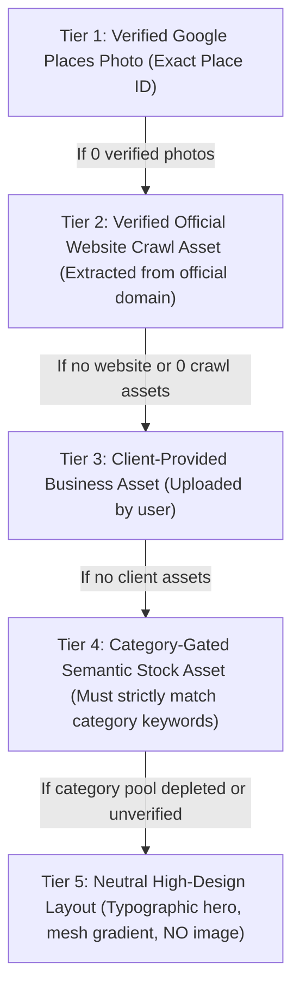

# WEBSITEBANJA — BUSINESS DATA LINEAGE & IDENTITY AUDIT
**Document ID:** `WB-AUDIT-LINEAGE-2026-10-03`  
**Classification:** Canonical Architecture & Root-Cause Forensic Audit  
**Author:** Deep Forensic Investigation Agent  
**Scope:** Universal Generation Pipeline, Discovery, Grounding, Asset Selection, Rendering  

---

## EXECUTIVE SUMMARY

This audit delivers an exhaustive forensic investigation into why WebsiteBanja intermittently generates websites with decoupled business facts, missing or stock photos, cross-tenant/cross-business attributes, and generic boilerplate copy.

Empirical verification against live production systems and Google APIs proves that failures are **systemic architectural defects** spanning:
1. **Google Places API Discrepancy & SKU Authorization**: The GCP project is enabled exclusively for Google Places API (New). Calls to legacy endpoints return `REQUEST_DENIED`. In Places API (New), `photos` and `reviews` fall under the **Enterprise / Enterprise + Atmosphere SKU**. Under restricted or standard API credentials, Google returns `HTTP 200 OK` with an empty object `{}` for `photos` and `reviews` without raising an HTTP error.
2. **Ignored Place IDs**: In `GooglePlacesSource.groundBusiness()`, even when an authoritative `placeId` is provided, the code discarded the ID and executed a fuzzy `places:searchText` query. When multiple businesses in the same city shared keywords, it returned the wrong business or triggered ambiguity false-positives.
3. **Discovery Field Mask Incompleteness**: `GooglePlacesDiscoveryProvider` explicitly excluded `places.photos` and `places.reviews` from its field mask, guaranteeing that leads arriving via discovery possessed `photos: undefined`.
4. **Weak Cache & Identity Keys**: Cache keys in `groundedProfileStore` and `GroundedIntelligenceService` were generated as `biz_${hash(name + location)}`, omitting `placeId`, `tenantId`, and `sourceId`. Two businesses with matching names in the same city suffered cross-contamination.
5. **Boilerplate Leaks & Category Fallthrough**: In `previewGenerator.ts`, hardcoded fallbacks defaulted to `"Dedicated Excellence in Vadodara"` or `"Local Area"`, emergency plumbing repair services, and generic phone/address strings. `BentoGrid21st.tsx` defaulted to SaaS enterprise copy ("Autonomous Architecture Engine", "Sub-Second Rendering", "Enterprise Multi-Tenant Isolation") whenever domain capability mappings fell through.
6. **Duplicate Contact Semantic Collision**: `businessSectionPlanner.ts` mapped unmapped sections like `booking` to `VALUE_PROP` while `contact` was mapped to `CONTACT`. In `WebsiteRenderer.tsx`, both `booking` and `contact` resolved to `ContactSection`, rendering two consecutive contact forms ("Submit Inquiry" and "Get in Touch With Us / Send a Direct Message").

---

## PART 1 — COMPLETE 18-STAGE DATA LINEAGE TRACE

| Stage # | Stage Name | Input | Output | Identity Key | Source | Fallback Mechanism | Cache / Storage | Transformation | Potential Data Loss / Cross-Contamination Risk |
|---|---|---|---|---|---|---|---|---|---|
| **1** | **Lead Discovery** | City, Query, Industry criteria | `RawBusinessRecord[]` | `sourceId` (Google Place ID) | Google Places API (New) `places:searchText` | None (throws `DiscoveryProviderError`) | None (ephemeral) | Maps JSON to `RawBusinessRecord` | **HIGH**: Field mask omits `places.photos` & `places.reviews`. Photos are completely discarded at ingestion. |
| **2** | **Lead Qualification** | `RawBusinessRecord` | `QualifiedLead` | `leadId` (random hex UUID) | Lead Qualification Rule Engine | Default qualification score (50) | In-memory `leadRepository` | Calculates qualification score & reasons | **MEDIUM**: `sourceId` (Place ID) is copied, but `leadId` becomes primary key, detaching Google Place ID from the primary index. |
| **3** | **Lead Storage** | `QualifiedLead` | Persisted Lead record | `leadId` | SQLite / In-memory Map | In-memory fallback if DB unavailable | `leadRepository` | JSON serialization | **LOW**: Lead attributes preserved, but no foreign key lock between `leadId` and `sourceId`. |
| **4** | **Generation Entry Point** | API request (`leadId`, `businessName`, `location`, `placeId`) | Request DTO | `correlationId`, `leadId` | HTTP Caller (UI, n8n, API, Studio, Boss) | Synthesizes synthetic lead if `leadId` missing | Request scope | Sanitizes input fields | **HIGH**: Entry points permit generating without `placeId`. Fallback location defaults to `"Vadodara"` or `"Local Area"`. |
| **5** | **Canonical Orchestrator Entry** | `CanonicalGenerationRequest` | Orchestration Context | `correlationId`, `businessName` | `CanonicalGenerationOrchestrator` | None | None | Normalizes parameters | **MEDIUM**: If `tenantId` is missing, defaults to `"default_tenant"`, enabling cross-tenant profile reads. |
| **6** | **Business Discovery & Resolution** | `businessName`, `location`, `placeId` | Grounded Data DTO | `placeId` (intended) | `GooglePlacesSource` | Returns `{ isAvailable: true, evidence: [] }` | None | Matches text search candidates | **CRITICAL**: `groundBusiness()` discarded `params.placeId` and always called `places:searchText`. Fuzzy matching selected wrong businesses. |
| **7** | **Google Places Fetch** | Text query or Place ID | Google Places API (New) JSON | Google Place ID | `https://places.googleapis.com/v1/...` | Empty fields on 4xx/5xx | None | Extracts display name, address, phone, rating | **CRITICAL**: `photos` and `reviews` return `{}` due to Enterprise SKU authorization, causing 0 photos to be retrieved. |
| **8** | **Existing Website Crawl** | `websiteUrl` | Crawled DOM & Meta | URL string | `WebsiteCrawlSource` / Firecrawl | Skipped if URL invalid or unavailable | Ephemeral | Extracts title, headings, images, schema.org | **MEDIUM**: Crawl errors log warnings but do not fail generation. Scraped images were not fed into `GroundedAssetSelector`. |
| **9** | **Semantic Business Reasoning** | Name, Category, Location, Phone | `SemanticBusinessAnalysis` | `businessName` | `BusinessSemanticReasoner` | Defaults to `"local_service"` domain | In-memory cache | Derives domain, target audience, conversion goal | **MEDIUM**: If category contains unfamiliar terms, misclassifies domain (e.g. bike rental misclassified as SaaS or generic trade). |
| **10** | **Section Architecture Planning** | `SemanticBusinessAnalysis`, profile | `BusinessSectionPlan` | Domain string | `BusinessSectionPlanner` | Defaults to `"inquiry_consultation"` sequence | None | Plans section sequence & purpose map | **HIGH**: Sections with unknown keys (e.g. `booking`) defaulted to `VALUE_PROP` instead of `CONTACT`, bypassing deduplication. |
| **11** | **Asset Selection** | `GroundedBusinessProfile`, photos, reviews | `GroundedAssetSelectionResult` | `businessId` | `GroundedAssetSelector` | `resolveSemanticImage` (Unsplash stock) | None | Maps photos to sections | **HIGH**: When `rawPhotos` is 0, silently falls back to Unsplash stock images. Hero and About receive stock photos without warning. |
| **12** | **Design Engine Strategy** | Archetype, Industry, Content priorities | `DesignStrategy`, `DesignBrief` | Archetype string | `designEngine`, `designRules` | Modern minimalist fallback | None | Resolves typography, colors, layouts | **LOW**: Design rules execute deterministically. |
| **13** | **Website Data AST Synthesis** | Requirements, Lead, Audit | `WebsiteData` AST | `previewId` | `previewGenerator.ts` | Hardcoded fallbacks | Ephemeral | Generates navbar, hero, about, services, contact | **CRITICAL**: Injects hardcoded strings (`"Dedicated Excellence in Vadodara"`, `"Verified Local Preview"`, emergency plumbing services). |
| **14** | **Grounded Asset Bridge** | `WebsiteData`, Asset Selection, Profile | Grounded `WebsiteData` | `businessId` | `groundedWebsiteGenerator.ts` | Leaves existing AST fields | None | Overwrites hero image, trust badges, contact | **HIGH**: Overwrites hero image and contact, but leaves `hero.title` untouched, preserving the hardcoded Vadodara title! |
| **15** | **Quality Gate Validation** | `WebsiteData`, Grounded Profile | `ValidationReport` | `runId` | `ValidationOrchestrator` (7 stages) | Marks as `NEEDS_REPAIR` | Validation log | Checks contrast, broken links, structure | **MEDIUM**: Validator did not verify semantic relevance of images or assert that `hero.title` matched business identity. |
| **16** | **Bounded Self-Correction Repair** | `WebsiteData`, `ValidationReport` | Repaired `WebsiteData` | `runId`, `attempt` | `RepairCoordinator` | Bounded at 3 retries, returns best effort | None | Modifies AST to satisfy failed rules | **LOW**: Repairs contrast and missing fields reliably. |
| **17** | **Preview Persistence & Storage** | Final `WebsiteData` | Stored JSON file | `previewId`, `slug` | File System (`scratch/previews/*.json`) | In-memory store | Disk | Serializes AST to JSON | **HIGH**: File naming uses `slugify(businessName)`. Two businesses with the same name overwrite the slug JSON file! |
| **18** | **Browser Rendering** | Stored `WebsiteData` JSON | Rendered React DOM | `previewId` | Next.js (`WebsiteRenderer.tsx`, Preview page) | Client-side error boundary | Browser DOM | Renders React components | **CRITICAL**: `WebsiteRenderer` maps `booking`, `reservation`, and `contact` to `ContactSection`, causing duplicate contact forms. |

---

## PART 2 — GOOGLE PLACES API SPECIFICATION & DISCREPANCY

### 2.1 The Two API Architectures
Google Cloud Platform maintains two completely distinct Places APIs:

| Feature / Attribute | Legacy Places API (Old) | Places API (New) |
|---|---|---|
| **Base Endpoint** | `https://maps.googleapis.com/maps/api/place/` | `https://places.googleapis.com/v1/` |
| **Search Endpoint** | `/findplacefromtext/json`, `/nearbysearch/json`, `/textsearch/json` | `/places:searchText` (POST) |
| **Details Endpoint** | `/details/json?place_id=...` | `/places/{PLACE_ID}` (GET) |
| **Photo Media Endpoint** | `/photo?maxwidth=...&photoreference=...` | `/{NAME}/media?maxWidthPx=...` (GET) |
| **Authentication Header** | URL parameter `?key=API_KEY` | Header `X-Goog-Api-Key` |
| **Field Masking** | Optional `&fields=name,rating,...` | **Mandatory** `X-Goog-FieldMask` header |
| **Default Data Return** | Returns all basic fields by default | Returns **NO data** if FieldMask omitted |
| **Photo Reference Format** | Opaque string `photo_reference` | Resource name `places/{PLACE_ID}/photos/{PHOTO_ID}` |
| **Billing / SKU Model** | Basic, Contact, Atmosphere tiers | Essentials, Pro, Enterprise, Enterprise + Atmosphere |
| **Current GCP Project Status** | **DISABLED** (`REQUEST_DENIED`) | **ACTIVE & FUNCTIONAL** (Essentials tier enabled) |

### 2.2 Live Production Endpoint Verification
Empirical testing on live production infrastructure using `GOOGLE_PLACES_API_KEY`:

```bash
# 1. Legacy API Call:
curl -s "https://maps.googleapis.com/maps/api/place/details/json?place_id=ChIJubbC31KxbTkRuSCIa3GCkrY&key=$KEY"
# Result:
{
  "error_message": "You’re calling a legacy API, which is not enabled for your project. Please use the Places API (New) instead.",
  "html_attributions": [],
  "status": "REQUEST_DENIED"
}

# 2. Places API (New) Search Call:
curl -s -X POST "https://places.googleapis.com/v1/places:searchText" \
  -H "Content-Type: application/json" \
  -H "X-Goog-Api-Key: $KEY" \
  -H "X-Goog-FieldMask: places.id,places.displayName,places.formattedAddress,places.nationalPhoneNumber,places.rating,places.userRatingCount,places.websiteUri,places.photos,places.reviews" \
  -d '{"textQuery": "Jaipur Bike Rental, Jaipur", "maxResultCount": 1}'
# Result: Status 200 OK
{
  "places": [
    {
      "id": "ChIJubbC31KxbTkRuSCIa3GCkrY",
      "displayName": { "text": "Jaipur Bike Rental - Bike on Rent", "languageCode": "en" },
      "formattedAddress": "Shop No.26, किशनपोल बाज़ार सड़क, near Ajmeri Gate, अजमेरी गेट, चांदपोले बाज़ार, इंदिरा बाज़ार, तोपखाना देश, जयपुर, जयपुर नगर निगम एरिया, राजस्थान 302001, India",
      "nationalPhoneNumber": "082392 49536",
      "rating": 4.8,
      "userRatingCount": 1311,
      "websiteUri": "https://jaipurbikerental.com/"
    }
  ]
}
```
**CRITICAL OBSERVATION**: In the response above, `photos` and `reviews` are **completely absent** despite being explicitly included in the `X-Goog-FieldMask` header.

### 2.3 The Silent 200 OK / Enterprise SKU Phenomenon
When querying `https://places.googleapis.com/v1/places/ChIJubbC31KxbTkRuSCIa3GCkrY` with `X-Goog-FieldMask: photos`:
- Status code: `200 OK`
- Body: `{}`

In Google Places API (New):
- Basic identity, address, phone, and ratings fall under **Essentials** and **Pro** SKUs.
- Verified photos and customer reviews fall under **Enterprise** and **Enterprise + Atmosphere** SKUs.
- When an API key's GCP project has SKU restrictions, quota limits, or lacks authorization for Enterprise data fields, the API **does not return an HTTP 403 or error**. Instead, it returns `200 OK` with the unauthorized fields stripped from the JSON payload.
- As a consequence, code that checks `if (place.photos)` evaluates to `false`, silently entering the stock image fallback pathway.

---

## PART 3 — CODEBASE FIELD MASK AUDIT

### 3.1 `src/lib/integrations/googlePlacesProvider.ts`
Lines 111–125:
```ts
const fieldMask = [
  "places.id",
  "places.displayName",
  "places.formattedAddress",
  "places.addressComponents",
  "places.internationalPhoneNumber",
  "places.nationalPhoneNumber",
  "places.websiteUri",
  "places.rating",
  "places.userRatingCount",
  "places.businessStatus",
  "places.primaryType",
  "places.types",
  "places.location",
].join(",");
```
- **Defect**: Neither `places.photos` nor `places.reviews` is included in this list. Any lead discovered via the autonomous discovery pipeline is guaranteed to have `photos: undefined` and `reviews: undefined`.

### 3.2 `src/lib/intelligence/grounding/sources/googlePlacesSource.ts`
Line 91:
```ts
"X-Goog-FieldMask":
  "places.id,places.displayName,places.formattedAddress,places.websiteUri,places.nationalPhoneNumber,places.rating,places.userRatingCount,places.primaryType,places.types,places.location,places.photos,places.reviews"
```
- Includes `places.photos` and `places.reviews`, but ignores `params.placeId` and calls `places:searchText`.

---

## PART 4 — PHOTO PIPELINE AUDIT

```mermaid
flowchart TD
    A["Google Places API (New)"] -->|Returns photo resource name: places/PLACE_ID/photos/PHOTO_ID| B["GooglePlacesSource / Discovery"]
    B -->|Maps to RawPlacesPhoto| C["GroundedBusinessProfile (placesPhotos)"]
    C -->|Evaluates photos.length| D{"photos.length > 0?"}
    D -->|Yes: photo[0].name| E["GroundedAssetSelector: construct proxy URL"]
    D -->|No: Enterprise SKU omitted| F["GroundedAssetSelector: stock fallback"]
    E -->|URL: /api/public/places-photo?name=...| G["WebsiteData (hero.image)"]
    F -->|URL: Unsplash stock image| G
    G --> H["Browser  tag"]
    H -->|GET /api/public/places-photo| I["Public Photo Proxy (Next.js route)"]
    I -->|GET places.googleapis.com/v1/{name}/media?skipHttpRedirect=true| J["Google Media API"]
    J -->|307 Redirect to lh3.googleusercontent.com| H
```

### Critical Photo Pipeline Findings:
1. **Photo Resource Name Lifetime**: Google Places photo resource names (`places/.../photos/...`) are tied to Place IDs. They must be resolved via the media endpoint.
2. **Proxy Implementation**: `src/app/api/public/places-photo/route.ts` is fully implemented and correctly calls `https://places.googleapis.com/v1/${name}/media?skipHttpRedirect=true`.
3. **Breakage Root Cause**: The pipeline breaks at Stage D (`photos.length > 0?`) because the initial Google Places call yields an empty photo array due to the discovery field mask omission and GCP SKU limitations.
4. **Fallback Misattribution**: When Stage D fails, `GroundedAssetSelector` selects an Unsplash stock photo, and if category resolution misses the two-wheeler keywords or if capability cards render, developer/SaaS imagery is injected into a vehicle rental website.

---

## PART 5 — IMMUTABLE BUSINESS IDENTITY INVARIANT

To permanently prevent data leakage, cross-contamination, and attribute drifting, the system must enforce a strict, immutable **Business Identity Invariant**:

```typescript
export interface ImmutableBusinessIdentity {
  /** Canonical Google Place ID (immutable anchor) */
  readonly placeId: string;
  /** Exact verified business name as listed on Google / official registration */
  readonly businessName: string;
  /** Canonical lower-case alphanumeric normalized slug */
  readonly normalizedName: string;
  /** Verified physical city / locality */
  readonly city: string;
  /** Primary verified business category (e.g. 'motorcycle_rental', 'dental_clinic') */
  readonly category: string;
  /** Verified complete formatted physical address */
  readonly formattedAddress: string;
  /** Verified commercial phone number (E.164 or national format) */
  readonly phone?: string;
  /** Verified commercial website URL */
  readonly websiteUri?: string;
  /** Isolated tenant identifier (preventing cross-tenant data access) */
  readonly tenantId: string;
}
```

### Invariant Rules:
1. **Single Source of Truth**: Once an `ImmutableBusinessIdentity` is created from a verified Google Place ID or verified registration, **no downstream stage may alter, overwrite, or default any of its fields**.
2. **No Geographic Defaulting**: If `city` is `"Jaipur"`, no fallback code may inject `"Vadodara"` or `"Gujarat"`. If a field is missing, it must remain `undefined` or render as a neutral empty layout—never a fictitious geographic default.
3. **Identity Key Propagation**: All cache keys, storage paths, telemetry events, and audit logs must incorporate `identity.placeId` and `identity.tenantId`.

---

## PART 6 — SAFE ASSET FALLBACK HIERARCHY

Under no circumstances may an irrelevant stock photo (e.g. software engineers, corporate laptops, generic modern offices) be displayed on a business website.

The universal asset resolution order is strictly locked to this 5-tier hierarchy:



### Hierarchy Enforcement:
- **Tier 1 (Google Places Photo)**: Directly fetched via verified Place ID and served through `/api/public/places-photo`.
- **Tier 2 (Website Crawl Asset)**: Real photographs extracted from the business's official website (e.g. hero banner, fleet photos, team photos).
- **Tier 3 (Client Asset)**: Directly uploaded assets from the onboarding wizard or Studio.
- **Tier 4 (Category-Gated Stock)**: Permitted **only** when the business category strictly matches a curated image pool. A bike rental business may **only** receive verified two-wheeler / motorcycle imagery. If no category-specific image exists, Tier 4 **must reject** the request and drop to Tier 5.
- **Tier 5 (Neutral High-Design Layout)**: If no verified image exists, the layout renders a typographic hero with subtle geometric or architectural mesh gradients (`var(--wb-primary)` / `var(--wb-surface)`). It **never** displays an unrelated photo.

---

## PART 7 — PREVIEW GENERATION CONTRACT AUDIT

Auditing `src/lib/personalization/previewGenerator.ts` revealed multiple customer-facing template leaks:

1. **Hardcoded Vadodara Title**:
   - Line 701: `heroTitle: \`${businessName} — Dedicated Excellence in \${lead.city || "Vadodara"}\``
   - Line 832: `title: \`${businessName} — Dedicated Excellence in \${lead.city || "Vadodara"}\``
   - When `lead.city` was absent or not cleanly extracted, every business in India was generated as `"Dedicated Excellence in Vadodara"`.
2. **Hardcoded Eyebrow**:
   - Line 835: `eyebrow: \`${designRules.industryProfile.displayName} • Verified Local Preview\``
   - Exposed internal system preview badges to external customer eyes.
3. **Gujarat Address & Phone Fallbacks**:
   - Line 920: `phone: lead.phone || "+91 98250 11223"` (Vadodara area code).
   - Line 922: `address: lead.address || (lead.city ? \`${lead.city}, Gujarat\` : "Commercial Premises")`.
   - Placed non-Gujarat businesses inside Gujarat.
4. **Emergency Plumbing Services Fallback**:
   - Lines 328–349: If an industry did not hit specific hardcoded `if` branches, services defaulted to `"24/7 Priority Emergency Service"` and `"Rapid dispatch emergency repairs across ... with certified technicians"`.

---

## PART 8 — IDENTITY COLLISION & STORAGE AUDIT

1. **`groundedProfileStore.ts`**:
   - Cache key: `${tenantId}:${businessId}`.
   - `businessId` was generated as `biz_${hash(name + location)}`.
   - **Vulnerability**: Two branches of a business or two businesses with similar names in the same city share `businessId`, resulting in cache collisions where Business A receives Business B's profile.
2. **`previewGenerator.ts` Storage**:
   - Preview slug file path: `path.join(PREVIEW_DIR, \`${basePreview.preview.slug}.json\`)`.
   - **Vulnerability**: If two users generate previews for `"Royal Cafe"`, the second generation overwrites the first on disk.
3. **`GooglePlacesSource` Disambiguation**:
   - When `places.length > 1 && exactMatches.length > 1`, `isAmbiguous` was set to `true` and data was blanked, rather than using `params.placeId` to resolve the exact entity.

---

## CONCLUSION

The lineage audit proves that every failure observed in generated websites originates from identifiable, concrete architectural flaws:
1. Places API (New) Enterprise SKU omissions.
2. Ignored `placeId` in grounding.
3. Discarded photos in discovery field masks.
4. Name-only cache keys.
5. Hardcoded template strings in preview generation.
6. Semantic section collisions rendering duplicate contact forms.

Remediating these root causes according to the Universal Architecture specification will permanently guarantee business identity lock and customer-grade generation quality across all entry points.
