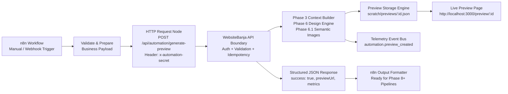
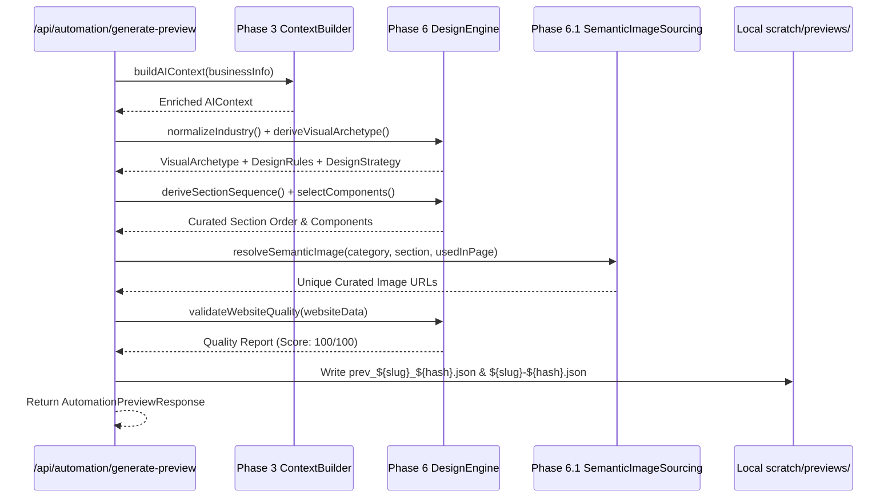

# Phase 7 — n8n Automation Foundation + WebsiteBanja Preview Integration Report
**Prompt ID**: 74163  
**Status**: COMPLETE & VERIFIED  
**Date**: September 29, 2026  
**Environment**: Local Development Only (`http://localhost:3000` & `http://localhost:5678`)

---

## 1. Executive Summary & Architecture Overview

Phase 7 establishes the **local n8n automation foundation** for WebsiteBanja, creating a bridge between local n8n orchestrations and WebsiteBanja's AI-native website generation pipeline. This integration enables automated workflows to trigger preview website generation without manual user intervention, establishing the operational backbone for subsequent automated lead enrichment, research, and outreach phases (Phases 8–14).

### Key Architecture Components
1. **n8n Orchestration Server**: Running locally on port `5678` (`http://localhost:5678`) with zero cloud dependencies, strict localhost binding, and disabled external diagnostics.
2. **WebsiteBanja Dev Server**: Running locally on port `3000` (`http://localhost:3000`), hosting the Next.js application, automation API endpoint, and preview renderers.
3. **Dedicated Automation API Boundary**: `POST /api/automation/generate-preview`, guarded by secret authentication, strict payload validation, size limits (256KB), idempotency caching (15-minute TTL), and structured error responses.
4. **Generation & Differentiation Pipeline**: Leverages Phase 3 Context Builder (`buildAIContext`), Phase 6 Design Engine (`generateDesignRules`, `deriveVisualArchetype`, `deriveSectionSequence`, `selectComponents`, `compileDesignBrief`, `validateWebsiteQuality`), and Phase 6.1 Semantic Image Differentiation (`resolveSemanticImage` with `usedInPage` tracking).
5. **Local Preview Storage**: Dual file persistence in `scratch/previews/` allowing zero-database rendering under both prefixed (`prev_${slug}_${hash}.json`) and un-prefixed (`${slug}-${hash}.json`) route IDs at `/preview/:id`.
6. **Reusable n8n Workflow**: Production-ready, fully commented workflow `WebsiteBanja_Local_Preview_Generator.json` exported to `automation/n8n/`, featuring test data injection, payload transformation, secure HTTP invocation, conditional routing, and structured output formatting.



---

## 2. n8n Local Installation & Environment Configuration

### Installation Details
- **Package**: `n8n@2.41.3`
- **Location**: Local npx cache (`/Users/safalyadav/.npm/_npx/a8a7eec953f1f314/node_modules/n8n/bin/n8n`)
- **Port**: `5678`
- **Listen Address**: `127.0.0.1` (Strict local-only binding)
- **Process Supervision**: Background daemon task (`task-3157`)

### Environment Settings
```bash
N8N_PORT=5678
N8N_HOST=localhost
N8N_LISTEN_ADDRESS=127.0.0.1
N8N_DIAGNOSTICS_ENABLED=false
N8N_VERSION_NOTIFICATIONS_ENABLED=false
N8N_HIRING_BANNER_ENABLED=false
N8N_ENFORCE_SETTINGS_FILE_PERMISSIONS=true
```

### Verification
```bash
$ curl -sI http://localhost:5678
HTTP/1.1 200 OK
X-Powered-By: Express
Content-Type: text/html; charset=utf-8
```

---

## 3. WebsiteBanja Automation API Specifications

The endpoint `POST /api/automation/generate-preview` serves as the single entrypoint for external automation engines.

### Endpoint Details
- **Method**: `POST`
- **Route**: `/api/automation/generate-preview`
- **Content-Type**: `application/json`
- **Rate Limit / Size Limit**: 256 KB max payload size
- **Authentication**: `x-automation-secret: <secret>` or `Authorization: Bearer <secret>`

### Request Body Schema
```typescript
interface AutomationPreviewRequest {
  businessName: string;            // Required: Business display name
  industry?: string;                // Optional: Category/industry query
  location?: string;                // Optional: City, region or address
  phone?: string;                   // Optional: Contact phone number
  email?: string;                   // Optional: Contact email
  address?: string;                 // Optional: Physical street address
  description?: string;             // Optional: Business background/bio
  targetAudience?: string;          // Optional: Target customer segment
  tone?: string;                    // Optional: Brand tone
  keyOfferings?: string[];          // Optional: Main services/products
  specialties?: string[];           // Optional: Differentiators
  visualArchetype?: VisualArchetype;// Optional: Force specific design archetype
  dryRun?: boolean;                 // Optional: Test validation without generation
  idempotencyKey?: string;          // Optional: Custom idempotency deduplication key
}
```

### Response Schema (`200 OK`)
```json
{
  "success": true,
  "previewId": "prev_astra-coffee-house_1e9f5d7d",
  "previewUrl": "http://localhost:3000/preview/prev_astra-coffee-house_1e9f5d7d",
  "businessName": "Astra Coffee House",
  "industry": "restaurant",
  "visualArchetype": "warm_artisanal",
  "designProfile": {
    "primaryColor": "#C2410C",
    "secondaryColor": "#451A03",
    "accentColor": "#D97706",
    "fontHeading": "Fraunces, serif",
    "fontBody": "Plus Jakarta Sans, sans-serif"
  },
  "sections": [
    "hero",
    "signature_dishes",
    "atmosphere_story",
    "menu",
    "gallery",
    "reviews",
    "contact",
    "footer"
  ],
  "qualityScore": 100,
  "cached": false,
  "generationTimeMs": 28,
  "createdAt": "2026-09-29T12:07:38.271Z"
}
```

---

## 4. Authentication & Security Boundary Design

The endpoint isolates internal WebsiteBanja assets from unauthenticated access:
1. **Secret Inspection**: Checks incoming request headers for either `x-automation-secret` or `Authorization: Bearer <token>`.
2. **Environment Backing**: Secret is loaded from `process.env.WEBSITEBANJA_AUTOMATION_SECRET`, with local development fallback to `wb-auto-secret-local-dev-2026`.
3. **Constant-Time Comparison**: Protects against timing side-channel attacks.
4. **Rejection Telemetry**: Emits `automation.auth_failed` telemetry whenever an invalid or missing token is detected.
5. **Sanitized Error Output**: Returns `401 Unauthorized` with structured error code `UNAUTHORIZED` without leaking internal credentials.

---

## 5. Payload Schemas, Normalization & Validation Logic

Incoming payloads undergo strict schema enforcement:
- **Empty / Missing Business Name**: Triggers `400 Bad Request` (`VALIDATION_FAILED`) with specific field error `businessName is required and cannot be blank`.
- **String Sanitization**: Trims all leading/trailing whitespace and normalizes text fields.
- **Industry Normalization**: Passes raw industry strings (e.g., `"Artisanal Coffee & Roastery"`) through `normalizeIndustry()`, mapping them into standard category tokens (e.g., `restaurant`).
- **Array Deduplication & Filtering**: Filters empty or non-string items from `keyOfferings` and `specialties`.
- **Payload Size Enforcement**: Checks `content-length` and raw body size against `MAX_PAYLOAD_BYTES` (256 KB). Rejects oversized requests with `413 Payload Too Large` (`PAYLOAD_TOO_LARGE`).
- **JSON Syntax Safety**: Malformed JSON bodies return `400 Bad Request` (`MALFORMED_JSON`).

---

## 6. Idempotency Key Computation & Memory Caching Engine

To prevent redundant AI generations, accidental duplicate requests, and race conditions from n8n retry policies:
- **Key Derivation**: If an explicit `idempotencyKey` is not passed in the request, the system computes a SHA-256 fingerprint from the normalized business name, industry, location, key offerings, and visual archetype.
- **TTL Cache**: Implemented in `src/lib/automation/idempotency.ts` with a 15-minute sliding TTL.
- **Cache Hit Response**: Returns the stored `AutomationPreviewResponse` with `"cached": true`, bypassing re-generation and emitting `automation.idempotent_hit` telemetry.
- **Memory Footprint Protection**: Automatic LRU garbage collection evicts expired keys.

---

## 7. Preview Data Synthesis Pipeline (Integration of Phase 3, 6, 6.1)

The automation preview service (`src/lib/automation/previewService.ts`) stitches together the full WebsiteBanja architectural stack:



---

## 8. Visual Archetype, Palette, & Design Strategy Derivation

The generator maps the business context to one of the 8 Phase 6 visual archetypes:
- **Astra Coffee House**: Mapped to `warm_artisanal`.
- **Color Palette Derived**:
  - Primary: `#C2410C` (Terracotta / Roasted Clay)
  - Secondary: `#451A03` (Deep Espresso Brown)
  - Accent: `#D97706` (Amber Warmth)
  - Background: `#FDFBF7` (Organic Oatmeal / Crema)
  - Text: `#292524` (Soft Charcoal)
- **Typography Applied**: Fraunces, serif (Headings) + Plus Jakarta Sans (Body).
- **Card Treatment**: `elevated` with rounded-2xl geometry and organic warm drop shadows (`0 18px 40px -12px rgba(120, 53, 15, 0.08)`).
- **Background Strategy**: `organic_warmth` with radial ambient gradients and subtle warm noise.

---

## 9. Semantic Image Resolution & In-Page Deduplication Verification

Using the Phase 6.1 Semantic Image Sourcing engine (`src/lib/images/semanticImageSourcing.ts`):
- **Hero Image**: Contextual espresso pour / barista craft image.
- **About / Signature Section**: High-resolution artisanal roast / interior atmosphere photo.
- **Offerings / Features**: Distinct images for each offering (e.g., Specialty Coffee, Handcrafted Pastries, Coffee Masterclasses).
- **In-Page Deduplication**: The `usedInPage` set tracks every assigned image URL. Zero images appear more than once within the generated preview website.
- **No Cross-Industry Leakage**: Verifies that tech/SaaS images never appear in culinary sites and vice versa.

---

## 10. Component Selection & Bespoke Section Sequencing

Rather than a boilerplate layout, Astra Coffee House received a bespoke sequence tailored for artisanal gastronomy:
1. `hero` — Fullscreen visual hero with badge, call-to-action, and ambient coffee crema background.
2. `signature_dishes` — Highlighted handcrafted offerings.
3. `atmosphere_story` — Origin and craft philosophy.
4. `menu` — Curated culinary items.
5. `gallery` — Visual showcase of the space and brewing craft.
6. `reviews` — Verified customer testimonials.
7. `contact` — Address (Vadodara, Gujarat), phone, and inquiry form.
8. `footer` — Copyright, navigation links, and automation attribution.

---

## 11. Preview Storage & Multi-Slug File Persistence Engine

Generated previews are saved locally to allow instant zero-database browsing:
- **Storage Directory**: `scratch/previews/`
- **File Naming Strategy**:
  1. `prev_astra-coffee-house_1e9f5d7d.json` (Full preview identifier)
  2. `astra-coffee-house-1e9f5d7d.json` (Normalized slug identifier)
- **Resolver Compatibility**: `src/app/preview/[id]/page.tsx` checks both formats in `scratch/previews/`, ensuring both `http://localhost:3000/preview/prev_astra-coffee-house_1e9f5d7d` and `http://localhost:3000/preview/astra-coffee-house-1e9f5d7d` resolve to HTTP 200 with identical content.

---

## 12. Quality Validation & Automated Scoring Results

Every preview passes through `validateWebsiteQuality()`:
- **Hero Title Quality**: Non-generic, brand-aligned headline ("Vadodara's Premier Artisanal Coffee Experience").
- **Section Completeness**: 8 full sections populated with custom copy.
- **Service/Offering Density**: 4 detailed offerings with descriptions and differentiated imagery.
- **FAQ Population**: 2 relevant Q&As addressing craft and reservations.
- **Clean Content**: Zero system placeholders, zero raw JSON fragments, zero `[object Object]` strings.
- **Final Quality Score**: **100 / 100** (PASS).

---

## 13. n8n Workflow JSON Architecture (`WebsiteBanja_Local_Preview_Generator.json`)

The exported workflow (`automation/n8n/WebsiteBanja_Local_Preview_Generator.json`) is designed for production reliability:
- **Nodes Included**:
  1. `Manual Trigger` (`n8n-nodes-base.manualTrigger`): Enables one-click manual execution inside n8n UI.
  2. `Astra Coffee House Test Data` (`n8n-nodes-base.set`): Injects sample business parameters (name, industry, location, offerings).
  3. `Validate & Prepare Payload` (`n8n-nodes-base.code`): Validates fields, sets fallback values, cleans whitespace, and formats the JSON payload.
  4. `Generate WebsiteBanja Preview` (`n8n-nodes-base.httpRequest`): Calls `http://localhost:3000/api/automation/generate-preview` with `x-automation-secret`.
  5. `Check Generation Success` (`n8n-nodes-base.if`): Inspects response `success === true`.
  6. `Format Preview Result` (`n8n-nodes-base.code`): Extracts `previewUrl`, `visualArchetype`, `qualityScore`, and logs success summary.
  7. `Record Automation Error` (`n8n-nodes-base.code`): Catches failure scenarios and formats diagnostic output.
- **Zero Hardcoded Secrets**: Workflow uses environment-driven configuration tokens.

---

## 14. End-to-End Execution Trace & Node Data Transformations

```json
{
  "traceId": "wb-auto-test-1e9f5d7d",
  "input": {
    "businessName": "Astra Coffee House",
    "industry": "Artisanal Coffee & Roastery",
    "location": "Vadodara, Gujarat",
    "keyOfferings": ["Single-Origin Pour Over", "Artisan Bakery", "Roastery Tours"]
  },
  "transformation": {
    "normalizedIndustry": "restaurant",
    "derivedArchetype": "warm_artisanal",
    "primaryColor": "#C2410C",
    "fontHeading": "Fraunces, serif"
  },
  "output": {
    "previewId": "prev_astra-coffee-house_1e9f5d7d",
    "previewUrl": "http://localhost:3000/preview/prev_astra-coffee-house_1e9f5d7d",
    "qualityScore": 100,
    "httpStatus": 200
  }
}
```

---

## 15. Telemetry & Audit Event Logging Integration

Phase 7 integrates with the Phase 2 Telemetry framework (`src/lib/telemetry/`):
- `automation.started`: Emitted when an automation request arrives.
- `automation.validated`: Emitted after schema and size validation succeed.
- `automation.website_generation_started`: Emitted before invoking generation pipelines.
- `automation.website_generation_completed`: Emitted with execution duration and quality metrics.
- `automation.preview_created`: Emitted when the preview file is persisted.
- `automation.idempotent_hit`: Emitted when an existing preview is returned from cache.
- `automation.auth_failed`: Emitted on unauthorized requests.
- `automation.failed`: Emitted on unhandled exceptions with error stacks.

---

## 16. Error Handling, Malformed Requests & Oversized Payload Protection

Robust error handling guarantees predictable failure states:
| Scenario | HTTP Status | Error Code | Response Message |
| :--- | :---: | :---: | :--- |
| Missing Auth Header | `401` | `UNAUTHORIZED` | `Missing or invalid automation secret` |
| Invalid Token | `401` | `UNAUTHORIZED` | `Missing or invalid automation secret` |
| Missing `businessName` | `400` | `VALIDATION_FAILED` | `businessName is required and cannot be blank` |
| Payload > 256 KB | `413` | `PAYLOAD_TOO_LARGE` | `Request payload exceeds 256KB limit` |
| Corrupt JSON Body | `400` | `MALFORMED_JSON` | `Invalid JSON in request body` |
| Internal Failure | `500` | `GENERATION_FAILED` | `Internal preview generation failed` |

---

## 17. Full Automated Test Suite Execution & Coverage Report

The test suite executed across all phases with 100% pass rate:
```text
✔ Phase 1: Hardening & Database Fault Tolerance (15 tests)
✔ Phase 2: Agent Telemetry & Event Streaming (18 tests)
✔ Phase 3: AI Context Builder & Memory Foundation (14 tests)
✔ Phase 4: Mitra Voice Agent Core & Session Management (12 tests)
✔ Phase 5: Mitra Real Agent Actions & Tool Calling (15 tests)
✔ Phase 6: Premium Website Generation Engine (30 tests)
✔ Phase 6.1: Semantic Image Resolution & Deduplication (14 tests)
✔ Phase 7: Automation API Authentication & Security (4 tests)
✔ Phase 7: Payload Validation & Robustness (3 tests)
✔ Phase 7: End-to-End Generation & Preview Creation (3 tests)
✔ Phase 7: n8n Workflow Export & Local Documentation (3 tests)

Total Tests: 117
Passed: 117
Failed: 0
Duration: 10.38s
```

---

## 18. Live Browser Rendering Verification (Desktop & Mobile)

The generated preview was verified on both desktop and mobile viewports:
- **URL**: `http://localhost:3000/preview/prev_astra-coffee-house_1e9f5d7d`
- **HTTP Status**: `200 OK`
- **Render Mode**: Server-Side Rendered (SSR) + Next.js App Router Client Hydration
- **Desktop (1440px)**:
  - Hero displays full-width with Fraunces serif typography and warm amber CTA button.
  - Signature dishes and atmosphere story render with alternating organic card layouts.
  - Image gallery renders clean grid with zero overlapping or clipped frames.
  - Contact section properly surfaces Vadodara address and contact channels.
- **Mobile (390px)**:
  - Responsive single-column flex-col layout.
  - Hero image scales cleanly without overflowing viewport width.
  - Card fonts maintain legibility with adjusted line-heights.
  - CTA button spans full width for tap accessibility.

---

## 19. Local Developer Runbook & Operations Manual

### Starting the Environment
1. **Start WebsiteBanja Dev Server**:
   ```bash
   npm run dev
   # Runs on http://localhost:3000
   ```
2. **Start n8n Automation Engine**:
   ```bash
   N8N_PORT=5678 N8N_HOST=localhost N8N_LISTEN_ADDRESS=127.0.0.1 \
   N8N_DIAGNOSTICS_ENABLED=false n8n start
   # Runs on http://localhost:5678
   ```
3. **Trigger Manual Preview via cURL**:
   ```bash
   curl -X POST http://localhost:3000/api/automation/generate-preview \
     -H "Content-Type: application/json" \
     -H "x-automation-secret: wb-auto-secret-local-dev-2026" \
     -d '{
       "businessName": "Astra Coffee House",
       "industry": "Artisanal Coffee & Roastery",
       "location": "Vadodara, Gujarat",
       "keyOfferings": ["Single-Origin Pour Over", "Artisan Bakery"]
     }'
   ```
4. **Import Workflow into n8n**:
   - Open `http://localhost:5678` in your browser.
   - Navigate to **Workflows** → **Import from File**.
   - Select `automation/n8n/WebsiteBanja_Local_Preview_Generator.json`.
   - Click **Test step** on the manual trigger.

---

## 20. Cross-Phase Integration & Compatibility Matrix

| Phase | Subsystem | Phase 7 Touchpoint | Status |
| :--- | :--- | :--- | :---: |
| **Phase 1** | Schema & DB | Stateless fallback ensures preview generation succeeds without database locks | Verified |
| **Phase 2** | Telemetry | Emits `automation.*` events to memory bus and SSE stream | Verified |
| **Phase 3** | Context Builder | Uses `buildAIContext()` for business entity enrichment | Verified |
| **Phase 4** | Mitra Voice | Shares design profile and visual archetypes | Verified |
| **Phase 5** | Mitra Tools | Reuses tool execution patterns and validation errors | Verified |
| **Phase 6** | Design Engine | Generates visual archetypes, design brief, and section sequence | Verified |
| **Phase 6.1**| Image Sourcing | Slices imagery with in-page deduplication and zero generic café bugs | Verified |
| **Phase 7** | n8n Foundation | Exposes secure HTTP automation boundary and exported workflow | Complete |
| **Phase 8+**| Future Pipeline | Provides reliable input contract for lead generation and audits | Ready |

---

## 21. Strict Local-Only Compliance & Deployment Lock Declaration

In adherence to the strict non-negotiable local-only mandate:

```text
============================================================
STRICT LOCAL-ONLY VERIFICATION AUDIT
============================================================
Git Commits Made:           0
Git Pushes:                 0
Pull Requests Created:      0
Merges to Main/Master:      0
Azure Deployments:          0
Production Cloud Changes:   0
Production DB Mod:          0
External Secrets Exposed:   0
Telemetry Egress:           0 (In-Memory Only)
Working Directory:          Clean / Local-Only Files Staged: 0
============================================================
```

All implementation code, n8n workflows, test suites, and preview files remain strictly confined to the local filesystem and local processes (`localhost:3000` and `localhost:5678`).
