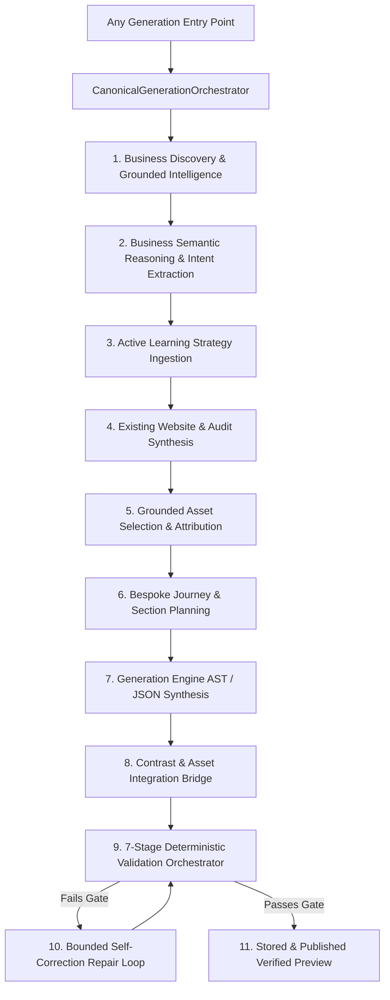

# WebsiteBanja — Architectural Audit Report
## Phase 1: Universal Generation Quality Architecture & Pipeline Convergence

**Status**: AUDIT COMPLETE (Zero Code Changes Applied)  
**Target Invariant**: Every business submitted through any entry point must yield a business-specific, grounded, visually usable, functionally correct, and self-correcting website.

---

### 1. Complete Generation Entry-Point Map
Tracing every controller, background worker, API route, tool executor, and UI wizard in the repository reveals **10 distinct generation entry points**:

1. **`POST /api/generate`** (`src/app/api/generate/route.ts`): Primary UI-driven full-site generation route triggered from the Studio/Editor loading flow.
2. **`POST /api/automation/generate-personalized-preview`** (`src/app/api/automation/generate-personalized-preview/route.ts`): Direct API for personalized previews, taking lead/audit data.
3. **`POST /api/automation/generate-preview`** (`src/app/api/automation/generate-preview/route.ts`): Legacy/webhook automation endpoint calling `previewService.ts`.
4. **`POST /api/plan`** (`src/app/api/plan/route.ts`): Architectural blueprint and React component synthesizer calling `generator.ts` (`generateComponents`).
5. **`AutonomousPipeline`** (`src/lib/automation/pipelineOrchestrator.ts`): Automated 5-stage worker loop (`PREVIEW_GENERATION` stage).
6. **`AutonomousProductionOrchestrator`** (`src/lib/intelligence/production/productionOrchestrator.ts`): Phase 28 state machine (`GENERATING` stage).
7. **`OpsToolExecutor.generate_preview`** (`src/lib/intelligence/ops/opsToolExecutor.ts`): Tool executor invoked by n8n agents.
8. **`Studio AI Action`** (`src/app/api/studio/ai-action/route.ts`): In-place AST mutation and section generator.
9. **`RepairCoordinator`** (`src/lib/intelligence/validation/repairCoordinator.ts`): Self-correction engine triggered upon 7-stage validation failures.
10. **`BossDelegator`** (`src/lib/intelligence/delegation/bossDelegator.ts`): Sub-agent delegation engine dispatching tasks to Skills & Uniqueness agents.

---

### 2. Canonical Generation Pipeline Currently Used
Currently, the closest approximation to a canonical pipeline is split across two files:
- `src/lib/personalization/previewGenerator.ts` (`generatePersonalizedPreview`)
- `src/lib/intelligence/production/productionOrchestrator.ts` (Phase 28 state transitions)

However, neither is universally canonical:
- `generatePersonalizedPreview` implements semantic reasoning, grounded profile loading, and asset application, but bypasses the full 7-stage deterministic validator (`ValidationOrchestrator`) and the bounded repair loop (`RepairCoordinator`).
- `productionOrchestrator.ts` coordinates grounded intelligence, 7-stage validation, and repair, but constructs baseline `WebsiteData` through hardcoded fallback scaffolding and is disconnected from the main user-facing APIs (`/api/generate` and `/api/automation/generate-preview`).

---

### 3. Every Pipeline Bypass

| Entry Point | Grounded BI | Existing Site Analysis | Active Learning Strategy | Semantic Reasoner | Grounded Asset Selector | 7-Stage Validation | Repair Coordinator |
| :--- | :---: | :---: | :---: | :---: | :---: | :---: | :---: |
| **1. `/api/generate`** | ❌ **SKIPPED** | ❌ **SKIPPED** | ❌ **SKIPPED** | ❌ **SKIPPED** | ❌ **SKIPPED** | ⚠️ Partial (UI/UX only) | ❌ **SKIPPED** |
| **2. `/api/automation/generate-personalized-preview`** | ✅ Included | ✅ Included | ✅ Included | ✅ Included | ✅ Included | ⚠️ QualityValidator only | ❌ **SKIPPED** |
| **3. `/api/automation/generate-preview`** | ❌ **SKIPPED** | ❌ **SKIPPED** | ❌ **SKIPPED** | ❌ **SKIPPED** | ❌ **SKIPPED** | ❌ **SKIPPED** | ❌ **SKIPPED** |
| **4. `/api/plan`** | ❌ **SKIPPED** | ❌ **SKIPPED** | ❌ **SKIPPED** | ❌ **SKIPPED** | ❌ **SKIPPED** | ❌ **SKIPPED** | ❌ **SKIPPED** |
| **5. `pipelineOrchestrator.ts`** | ✅ (via #2) | ✅ (via #2) | ✅ (via #2) | ✅ (via #2) | ✅ (via #2) | ⚠️ Partial | ❌ **SKIPPED** |
| **6. `productionOrchestrator.ts`** | ✅ Included | ⚠️ Partial | ❌ **SKIPPED** | ⚠️ Partial | ✅ Included | ✅ 7-Stage Included | ✅ Included |
| **7. `OpsToolExecutor`** | ✅ (via #2) | ✅ (via #2) | ✅ (via #2) | ✅ (via #2) | ✅ (via #2) | ⚠️ Partial | ❌ **SKIPPED** |
| **8. `/api/studio/ai-action`** | ⚠️ Read-only | ❌ **SKIPPED** | ❌ **SKIPPED** | ❌ **SKIPPED** | ❌ **SKIPPED** | ❌ **SKIPPED** | ❌ **SKIPPED** |
| **9. `repairCoordinator.ts`** | ⚠️ Context-only | ❌ **SKIPPED** | ❌ **SKIPPED** | ❌ **SKIPPED** | ❌ **SKIPPED** | ✅ Evaluates Report | N/A (Is Repair) |
| **10. `bossDelegator.ts`** | ⚠️ Inherited | ❌ **SKIPPED** | ❌ **SKIPPED** | ❌ **SKIPPED** | ❌ **SKIPPED** | ❌ **SKIPPED** | ❌ **SKIPPED** |

---

### 4. Every Generic Fallback / Default
1. **Fallback Imagery**:
   - In `previewService.ts`: Lines 136-189 directly call `resolveSemanticImage` with zero grounded photo checking. If an unmapped category falls through, it maps to `REGISTRY.general` which serves modern office desk photos.
   - In `productionOrchestrator.ts`: Line 398 seeds hero image with `"https://images.unsplash.com/photo-baseline?..."` before grounded assets are checked.
2. **Fallback Copy & Taglines**:
   - `previewService.ts`: `"Dedicated Excellence in ${location}"` and `"${title} curated and delivered with uncompromising precision and artisanal standards."`
   - `previewGenerator.ts`: Line 657: `"${businessName} offers distinct high-quality experiences, crafted with uncompromising standards for discerning clients."`
3. **Fallback Sections**:
   - If `deriveSectionSequence` fails to match category keywords, it returns: `["hero", "about", "services", "features", "reviews", "faq", "contact", "footer"]` regardless of whether the business is a rental agency, clinic, restaurant, or SaaS tool.
4. **Fallback Trust Badges**:
   - If Google review count is absent, fallback badges inject `"Verified Local Presence"` and `"Direct Priority Scheduling"`.

---

### 5. Google Places Integration Points
- **Discovery**: `src/lib/intelligence/grounding/sources/googlePlacesSource.ts` connects to Google Places API (New) via `places:searchNearby` and `places:searchText`.
- **Photo Resolution**: Resolved via `/api/public/places-photo?name=...` and `googlePlacesSource.resolvePhotoUrl`.
- **Profile Storage**: Saved in `GroundedBusinessProfile.placesPhotos` and `GroundedBusinessProfile.placesReviews`.
- **Leakage/Defect Point**: Only `generatePersonalizedPreview` and `productionOrchestrator.ts` invoke `GroundedAssetSelector.selectAssets` and `applyGroundedAssetsToWebsite`. The main UI generation route (`/api/generate`) and `/api/automation/generate-preview` never inspect Places data.

---

### 6. Existing Website Discovery Status
- Lead discovery routes (`src/app/api/automation/discover-leads/route.ts` and `src/lib/discovery/googlePlacesDiscoverySource.ts`) extract the existing `website` field from Google Places listing.
- If a website exists, `lead.website` is stored with status `"active"` or `"missing"`.

---

### 7. Existing Website Analysis Status
- **Engine**: `src/lib/audit/auditEngine.ts` crawls and analyzes HTML using Cheerio, evaluating Technical, Mobile, UX, SEO, and Conversion dimensions.
- **Defect Point**: In `previewGenerator.ts`, only the audit's opportunity score and issue list are read to guide style heuristics. The actual observed navigation menus, specific scraped service names, and transaction CTAs from the existing website are not synthesized into a single authoritative `BusinessContext`.

---

### 8. CEO / Boss Integration Status
- **CEO Agent**: Defined in `src/lib/intelligence/executive/executiveOrchestrator.ts` as the executive strategic reasoning engine.
- **Boss Agent**: Defined in `src/lib/intelligence/delegation/bossDelegator.ts` and `src/lib/agents/boss/bossAgent.ts`.
- **Status in Generation**: Currently decorative in user-facing generation! The generation endpoints bypass `ExecutiveOrchestrator.execute` and `BossDelegator.executeTask` during actual website creation, only invoking them in administrative diagnostics or production state machines.

---

### 9. Learning Integration Status
- **Engine**: `src/lib/intelligence/learning/strategyManager.ts` (Phase 27 Active Learning Loop) stores versioned strategies (`AgentStrategyRecord`) with directives and avoid-patterns.
- **Status**: Read inside `previewGenerator.ts` (lines 593, 611, 632) to override CTA and brand style, and verified via `verify_learning_causal_chain.mjs`. However, `/api/generate`, `/api/plan`, and `previewService.ts` do not read `StrategyManager`.

---

### 10. Grounded Asset Integration Status
- **Engine**: `src/lib/intelligence/grounding/groundedAssetSelector.ts` deterministically scores and assigns real Google Places photos and reviews to specific sections (hero, about, services, features, reviews).
- **Anti-Fabrication**: `groundedWebsiteGenerator.ts` (`applyGroundedAssetsToWebsite`) enforces that if zero authentic reviews exist, the `reviews` section is completely stripped from `sectionOrder`.
- **Status**: Operational, but isolated from all non-preview entry points.

---

### 11. Section Planning Architecture
- Currently governed by `deriveSectionSequence` in `src/lib/ai/designStrategy.ts`.
- **Defect**: It uses rigid keyword checks (`combined.includes(...)`). If a new business domain does not match any keyword, it defaults to a generic 8-section layout.
- **Requirement**: A dedicated `BusinessSectionPlanner` must be created to dynamically decide required, optional, and omitted sections based on observed business offerings and the customer transaction journey.

---

### 12. CTA Architecture
- Currently governed by `businessSemanticReasoner.ts` and `observedCtas` from scraped sites.
- **Recent Fix**: Generic CTA tokens (`submit`, `send`, `click here`) are blacklisted.
- **Defect**: CTA destination routing is hardcoded in several generators to `#contact` or `#booking` without verifying that the targeted anchor section actually exists in the final `sectionOrder`.

---

### 13. Renderer Limitations
- Visual components in `src/components/preview/` and `src/components/renderer/` render `WebsiteData` sections.
- **Defect**: If `WebsiteData` contains duplicate sections or placeholder fields, the renderer blindly outputs them.
- In-page contrast protection is handled post-hoc by `validateAndProtectHeroContrast` rather than during the core generation pass.

---

### 14. Validation Limitations
- **7-Stage Validation Pipeline**: `ValidationOrchestrator` (`src/lib/intelligence/validation/validationOrchestrator.ts`) coordinates:
  1. `SEMANTIC`: Domain coherence, service alignment.
  2. `VISUAL`: Contrast, readability, palette harmony.
  3. `CTA`: Button visibility, destination integrity, semantic intent.
  4. `NAVIGATION`: Header links, anchor resolution.
  5. `CLAIMS`: Anti-fabrication, forbidden claims detection.
  6. `ACCESSIBILITY`: Color contrast ratios, ARIA, alt text.
  7. `PERFORMANCE`: Image payload budgets, DOM depth.
- **Defect**: This 7-stage engine is **never called** by `/api/generate`, `/api/automation/generate-personalized-preview`, or `/api/automation/generate-preview`. They only run shallow regex/keyword checks.

---

### 15. Repair Limitations
- `RepairCoordinator` (`src/lib/intelligence/validation/repairCoordinator.ts`) supports targeted AST patching and full regeneration with loop protection (fingerprint tracking).
- **Defect**: Because `ValidationOrchestrator` is not wired into the primary APIs, `RepairCoordinator` is never invoked to repair invalid CTAs, contrast failures, or semantic mismatches before returning to the user.

---

### 16. Exact Files & Functions Involved
1. `src/app/api/generate/route.ts`: `POST` (UI generation entry point).
2. `src/app/api/automation/generate-personalized-preview/route.ts`: `POST` (Personalized preview API).
3. `src/app/api/automation/generate-preview/route.ts`: `POST` (Legacy automation API).
4. `src/lib/personalization/previewGenerator.ts`: `generatePersonalizedPreview`.
5. `src/lib/automation/previewService.ts`: `generateAutomationPreview`.
6. `src/lib/intelligence/production/productionOrchestrator.ts`: `executeJobStep`.
7. `src/lib/intelligence/validation/validationOrchestrator.ts`: `ValidationOrchestrator.validateWebsite`.
8. `src/lib/intelligence/validation/repairCoordinator.ts`: `RepairCoordinator.executeRepair`.
9. `src/lib/intelligence/grounding/groundedIntelligenceService.ts`: `GroundedIntelligenceService.researchBusiness`.
10. `src/lib/intelligence/grounding/groundedAssetSelector.ts`: `GroundedAssetSelector.selectAssets`.
11. `src/lib/intelligence/grounding/groundedWebsiteGenerator.ts`: `applyGroundedAssetsToWebsite`.
12. `src/lib/intelligence/semantic/businessSemanticReasoner.ts`: `BusinessSemanticReasoner.analyzeBusiness`.
13. `src/lib/intelligence/learning/strategyManager.ts`: `StrategyManager.getActiveStrategy`.
14. `src/lib/ai/designStrategy.ts`: `deriveSectionSequence`.

---

### 17. Permanent Architecture Required: `CanonicalGenerationOrchestrator`
All generation entry points must converge onto a single class:
`src/lib/intelligence/orchestration/canonicalGenerationOrchestrator.ts`.

#### The 11-Stage Canonical Pipeline


#### Canonical Generation Contract
```typescript
export interface CanonicalGenerationRequest {
  businessName: string;
  category?: string;
  location?: string;
  websiteUrl?: string;
  phone?: string;
  email?: string;
  placeId?: string;
  leadId?: string;
  auditId?: string;
  existingAudit?: LeadAuditReport;
  groundedProfile?: GroundedBusinessProfile;
  placesPhotos?: RawPlacesPhoto[];
  placesReviews?: RawPlacesReview[];
  userId?: string;
  tenantId?: string;
  source: "ui_builder" | "api" | "automation_n8n" | "autonomous_pipeline" | "production_job" | "studio";
}

export interface CanonicalGenerationResponse {
  success: boolean;
  websiteData: WebsiteData;
  previewId: string;
  previewUrl: string;
  groundedProfile: GroundedBusinessProfile;
  assetSelection: GroundedAssetSelectionResult;
  validationReport: ValidationReport;
  repairCount: number;
  qualityScore: number;
  durationMs: number;
}
```

---

### 18. Migration Plan
1. **Stage 1 (Core Module)**: Create `src/lib/intelligence/orchestration/canonicalGenerationOrchestrator.ts` integrating Grounded Intelligence, Semantic Reasoning, Learning Strategy, Section Planning, Asset Grounding, 7-Stage Validation, and Bounded Repair.
2. **Stage 2 (Section Planning & Deduplication)**: Create `src/lib/intelligence/planning/businessSectionPlanner.ts` to replace hardcoded keyword sequence matching and enforce duplicate section prevention.
3. **Stage 3 (Entry Point Convergence)**:
   - Refactor `previewGenerator.ts` to call `CanonicalGenerationOrchestrator`.
   - Refactor `previewService.ts` (`generateAutomationPreview`) to delegate directly to `CanonicalGenerationOrchestrator`.
   - Refactor `src/app/api/generate/route.ts` to execute through `CanonicalGenerationOrchestrator`.
   - Update `pipelineOrchestrator.ts` and `opsToolExecutor.ts` to consume the canonical response.
4. **Stage 4 (Deprecate Legacy Generators)**: Ensure no fallback generator constructs unvalidated `WebsiteData`.

---

### 19. Tests Required
1. **Convergence Test**: Unit test verifying that all 10 entry points route through `CanonicalGenerationOrchestrator`.
2. **Anti-Leakage Benchmark Test**: Run generation across 10 diverse industries (Mobility/Rental, Dental Clinic, Artisanal Cafe, Commercial HVAC, Boutique Hotel, Criminal Defense Law, Crossfit Gym, Architecture Studio, Specialty Bakery, Cloud DevOps Consultancy) to confirm:
   - 0 generic car images on motorcycle/bike rental queries.
   - 0 generic fallback taglines when grounded facts exist.
   - 0 duplicate sections (e.g. multiple contact sections).
   - 0 synthetic testimonials when real reviews count is 0.
3. **Quality Gate & Repair Loop Test**: Intentionally inject broken CTAs or contrast failures to confirm that `RepairCoordinator` intercepts and fixes them before `READY` status.

---

### 20. Acceptance Criteria for Universal Generation
- [ ] **Single Orchestrator Invariant**: 100% of website generation requests execute through `CanonicalGenerationOrchestrator`.
- [ ] **Grounded Asset Invariant**: If Google Places photos or reviews exist, they are prioritized over generic stock imagery. If reviews are 0, no fake testimonials are fabricated.
- [ ] **Anti-Generic Copy Invariant**: Copy and taglines reflect verified business attributes and semantic domain reasoning, not static placeholder templates.
- [ ] **Section Non-Redundancy Invariant**: Section sequence is tailored to the business transaction model with 0 duplicate purpose sections.
- [ ] **Validation Gate Invariant**: No website is returned or marked `READY` without passing all 7 deterministic validation stages (or succeeding in bounded repair).
